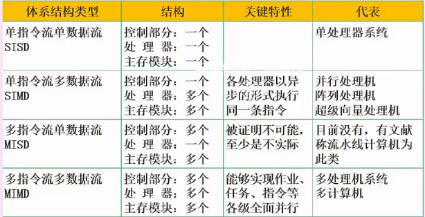
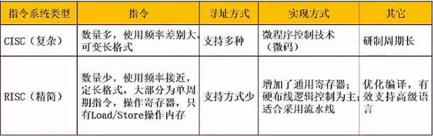
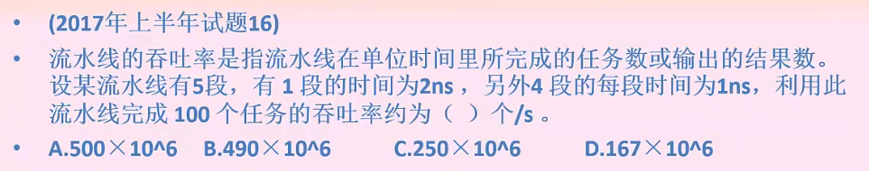

##### Flynn 分类

指令流 instruction stream 机器执行的指令序列

数据流 data stream  指令流调用的数据序列，包括输入数据和中间数据，不包括数据输出

**计算机指令组成**：操作码和操作数两部分，操作码决定干什么，操作数值运算的数据及数据所在单元位置

**计算机指令执行过程**：取指令——分析指令——执行指令

**指令寻址方式：**顺序执行；跳跃执行；

**指令操作数寻址方式：**立即寻址；直接寻址；间接寻址；寄存器寻址；等

**指令系统**   *常考*

**指令流水线：**将指令分成不同段，每段由不同的部分处理

**流水线周期：**指令分成不同执行段，其中执行时间最长的一段为流水线时间

**流水线执行时间：**1条指令总执行时间+（总指令条数-1）*流水线周期

**流水线加速比：**不使用流水线总执行时间/使用流水线总执行时间

**流水线吞吐率：**总指令条数/流水线执行时间

**超标量流水线技术：**常规流水线度为1，度的扩大就是成倍的增加了流水线的执行，这里主要影响 指令条数 = 指令条数（这里应该是指拆分后的）/度

计算过程：

吞吐率等于：总指令条数/流水线时间

总指令条数 100

流水线时间：一条指令执行总时间 （2+4） - （总指令数-1）*流水线周期 2  6+99*2 = 204

100/204 约等于 0.49 再ns转化s 相差10^9

