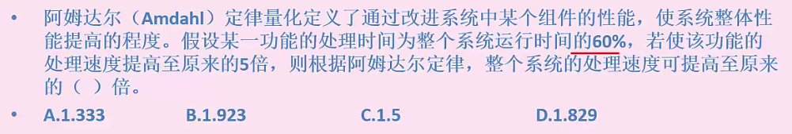
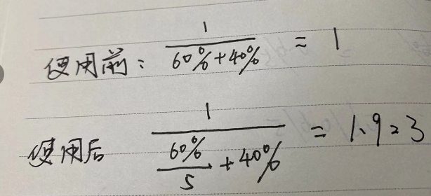

# 系统值与性能评价

**计算机系统性能指标**

可靠性或可用性：系统正常工作的时间（平均无故障时间）

吞吐率 

响应时间 

资源利用率

 

主频和CPU时钟周期：互为倒数

指令周期

总线周期

MIPS:百万条指令每秒

**性能评价方法**

时钟评率法：主频高低

指令执行速度法：通过加法指令运算速度衡量计算机速度 单位mips

等效指令速度发：不科学，不准确，各类指令在程序中所占比例

CTP综合理论性能法:更全面的计算，美国政府限制高性能计算机出口设计

##### **基准程序法**：把应用程序中主要用的程序作为测试的标准程序，广泛使用

**阿姆达尔解决方案**

对通知某组件采用某种更快的执行方式，所获得的改变程度，

R = 改进前总时间/改进后总时间

