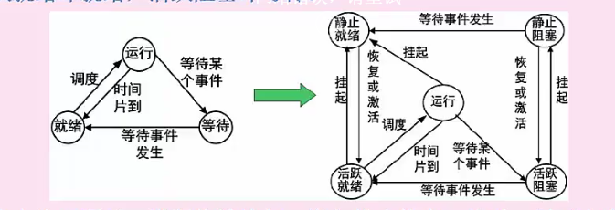

# 操作系统知识

### 操作系统概述

作用：通过资源管理提高工作效率，提供人机界面

特征：并发性，共享性，虚拟性，不确定性

功能：进程管理，存储管理，文件管理，设备管理

启动流程：bios(主板固定程序)->主引导记录->操作系统

### 进程管理

**组成**

进程控制块PCB（唯一标志）

程序（进程要干什么）

数据（存放运行时需要的数据）

**进程状态**

三态:等待是一般等待i/o 或者外设数据，就绪是指只差cpu了

**前趋图**

是指任务执行的顺序和关系，

这里表示 a b c 可以并行执行 d需要 a b c全执行完才能执行 e表示d执行完 e可以执行

**进程资源图**

P 即 process  R 即 Resource

进的箭头表示占有某个资源

出去的箭头表示却某个资源

阻塞：等待某个资源释放

所有节点都是阻塞情况的话就是死锁

**同步与互斥**

互斥/共享：资源可以被同时使用与否

同步：多任务并发执行，只不过存在速度上差异

临界资源：互斥资源

临界区：进程中对临界资源实时操作的程序（代码）

**信号量操作**

互斥信号量：互斥锁，初始值1

同步信号量：共享资源访问计数，初始值0

P 操作 : 申请资源 S=S-1 S>=0 继续执行 S<0 阻塞等待

V 操作：释放资源 S=S+1 S>0 执行V操作的进程继续执行，若S<=0，则从阻塞的状态唤醒一个进程，插入就绪队列，然后继续执行

**线程**

进程：可拥有资源的独立单位，可独立调度和分配的基本单位

线程：独立调度的最小单位，进程是拥有资源的最小单位

 

 

