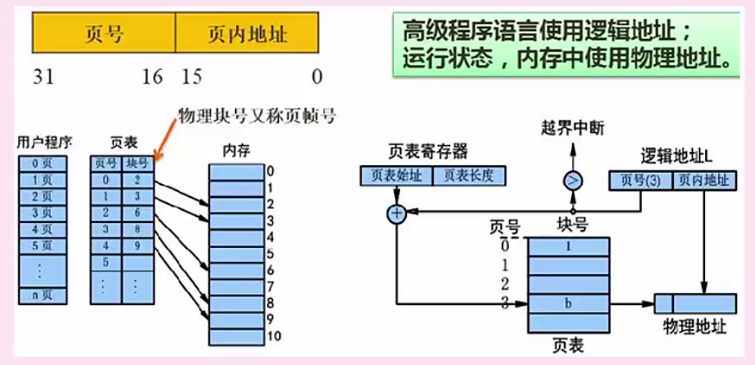
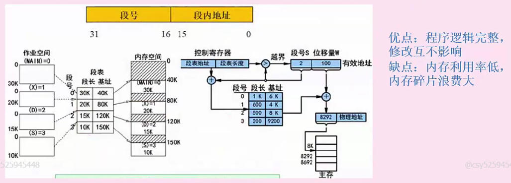
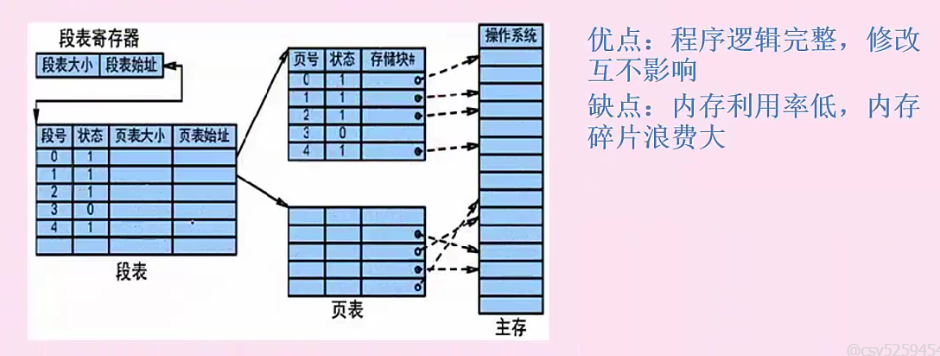

# 存储方式

### 页式存储管理

 

**大致思想：**就是把进程按照一定大小等分成多个页，页实际上就是一个个的逻辑地址，包括页号，和地址偏移量（页内地址），内存的物理存储也按照页划分相同大小等分，然后在进程运行时把对应的页和物理地址对应就是页表

所以页号能看出一共能有多少个页，业内地址能看出最大能存储多少

**优点**：利用率高，碎片小

**缺点**：增加系统开销，产生抖动现象

**注意点**：页表包括页号和块号，通过这两个号能够算出逻辑地址某段对应在内存中的某块

由于页内地址是指最大的地址偏移量，所以定好之后都是不变的

### 快表

本质也是页表，只是将页表存储在cache中，页表是存储在内存中，所以快表比页表更快

### 段是存储管理

**大致思想：**将进程空间分为一个个段，根据逻辑主体分段，不定长。

段实际上也是一个个逻辑地址，包括短号和段内地址跟页的设计差不多，只是不定长，内存地址按照段长对应划分，这中间的对应关系就是段表

**优点：**程序逻辑完成，修改互不影响

**缺点：**内存利用率低，碎片多

**注意点：**段表包含段长和基值 段长表示长度，基地址表示内存中的起始位置

### 段也是存储管理（几乎不考）

段页相结合

优点：空间浪费小，存储共享容易，能动态链接

缺点：复杂，开销大，执行效率低

