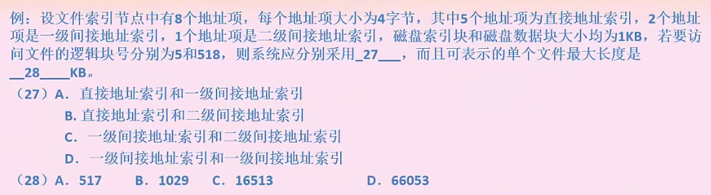
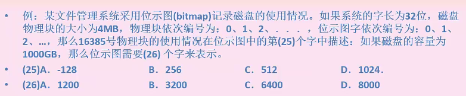
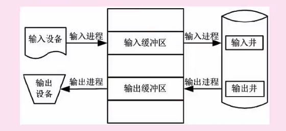

# 文件结构|设备管理|嵌入式

### 文件结构

**索引文件结构**：直接索引是直接存储的数据内容，一级间接索引存的是连接到直接物理盘块的地址，二级间接索引存储的是一级间接索引地址

思路：

由于直接索引直接存储内容所以 块号 就是索引的数量，由于块号是从0开始，所以5个直接索引对应块号就是4

现在要计算逻辑块号5和518分别在哪个地址索引，显然5是一级间接地址索引，

那么两个一级间接地址索引能够对应多少块号？

一个地址是4b，一个磁盘索引块是1kb,所以1kb/4b*2 = 512个块号 

一级间接地址索引的块号是从5开始 像后面推512个就是到517 ，所以518应该是二级间接地址的第一个块号，所以第一题选c

第二部分是 5+256\*1\*2+256\*256\*1 = 66053 就是所有地址索引能够表示的文件长度总和

### **树形目录**

**注意：**

全文件名等于绝对路径+文件名；

路径都是不包含文件名的

### 空闲存储空间管理

空闲区表法，空闲链表法，成组链接法

**位示图法：**对每个物理空间用一位标识，1为使用，0为空闲，形成位示图

**思路：**

一个字节是32位，所以16385  / 32 = 512 余1 选 c

1000*1024/4/32 = 8000		

### 设备管理

数据组织分类：块设备，字符设备

资源分配角度分类：独占设备，共享设备和虚拟设备

数据传输速率分类：低速设备，中速设备，高速设备

i/o软件层次结构

用户进程 - 设备无关软件 - 设备驱动程序 - 中断处理程序 - 硬件

### 输入输出技术

程序查询：CPU直接查询外设

程序中断：外设完成数据传输后。通知CPU中断，等待CPU处理数据

DMA（直接主存存取）：CPU值只需完成必要的初始化等操作，数据传输有DMA控制器完成

### 虚设备和spooling技术

把物理设备虚拟化，例如打印机，把所有的打印请求放到打印队列，然后打印机按照队列数据顺序打印。

### 微内核操作系统

微内核：内核小，功能少，便于剪裁和移植

单体内核：内核大，功能多，不用频繁切换用户态和核心态

### 嵌入式操作系统

微型化，代码质量高，专业化，实时性强

常见的实时操作系统：Wxworks Rt-Linux QNX pSOS

