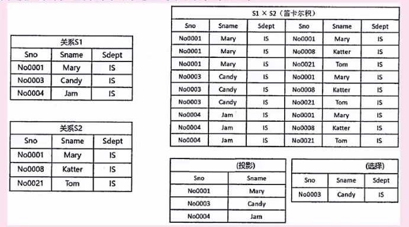
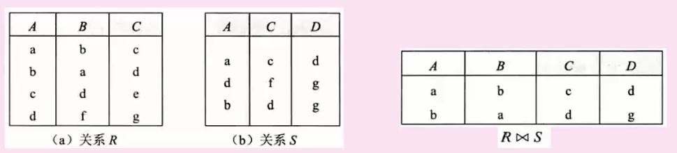
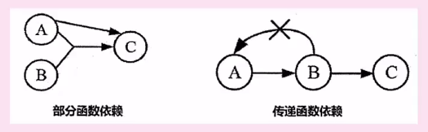

# 数据库技术基础

### 三级模式-两级印象

**模式**

内模式：管理如何存储物理的数据，对应具体物理存储文件

模式（概念模式）：通长使用的基本表

外模式：视图级别，将表进行一定处理后提供给用户使用，跟mysql 的 view 有什么关系？感觉现在越用越少了

**映像** （不怎么好理解）

外模式--模式映像：表和视图之间的映射，数据发生修改，只修改映射

模式--内模式映像：表和物理存储之间的映射，如果修改存储方式，只需要修改映射

**数据库设计流程**

需求分析：分析数据存储边界（数据流图，数据字典，数据说明书）

概念结构设计：实体，也就是没有关系的表（E-R图）

逻辑结构设计：存在关系的表 (关系模式)

物理设计：生成物理数据库

**E-R模型：**描述各个实体之间的各种关系（一对一，一对多，多对多）

关系代数运算

并：所有记录合并，相同记录显示一次 

交：两张表中相同记录 

差：S1-S2 S1中有而S2中没有 

**以上是两张表字段相同？这么做意义是什么**

笛卡尔积：S1 X S2  类似于不带条件的inner join **符号 X**

投影：按条件选择某关系模式中的某列  **符号π**

选择：按条件选择关系模式中的某行  **符号ρ**

投影和选择怎么来的？

投影：π1,2(S1)

选择：ρ1=No0003(S1)

自然连接 ：符号

只显示两个关系模式中属性值相同的记录（列名相同值相同的行会被采用），显示所有关系的所有列，相同的属性列只显示一次

**函数依赖**

部分函数依赖：A能确定C AB 也可以确定C (A B)中的一部分能确定C

传递函数依赖：A != B A能确定B B 能确定C 所以A能确定C

**键与约束**

假设有如下两个表：

学生（学号，姓名，性别，身份证号，教师编号）

教师（教师编号，姓名，工资）

**超键**：由超键的定义可知，学生表中含有学号或者身份证号的任意组合都为此表的超键。如：（学号）、（学号，姓名）、（身份证号，性别）等。

**候选键**：候选键属于超键，它是最小的超键，就是说如果再去掉候选键中的任何一个属性它就不再是超键了。学生表中的候选键为：（学号）、（身份证号）。

**主键**：主键就是候选键里面的一个，是人为规定的，例如学生表中，我们通常会让“学号”做主键，教师表中让“教师编号”做主键。

**外键**：外键比较简单，学生表中的外键就是“教师编号”。外键主要是用来描述两个表的关系。

**第一范式 1NF：**不能拆分出子表

**第二范式 2NF：**符合第一范式，  不允许存在部分函数依赖，也就是当表存在多个候选键的时候，任意的候选键能够决定某个属性

**第三范式 3NF：** 符合1 2 NF 不能存在传递依赖

**只要是候选码/键就是主属性**

**模式分解就是对不符合范式的情况进行拆分**

**无损分解：**分解后的关系模式能够还原出原关系模式，否则就是有损分解

