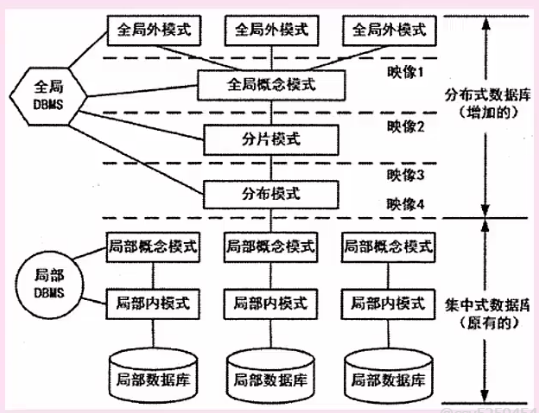
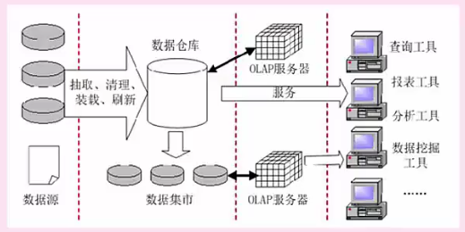

### 事物管理

**原子性：**一系列操作要么全做，要么全不做

**一致性：**跟原子性一回事

**隔离性：**其实就是互斥操作

**持续性：**事物操作的结果都是持续的

### **事物要解决的问题（并发）：**

**丢失更新：**事务1还没处理完，事务2拿到事务1还没处理完的结果，两个事务执行完之后，等于第一步的更新丢失了

**不可重复读：**事务1读完之后，事务2修改写回，事务1再读的时候发现两次读取数据不一致

**脏读：**事务1对数据做了修改，事务2读到了，后来事务1把数据回滚了

### 封锁协议

**互斥锁 X锁：**多个事务统一时间只允许一个事务读和写 

**共享锁 S锁：**多个事务共享读，同一时间永远只有一个事务修改

分布式数据库

**分片模式：**

水平分片：按行存储不同地方

垂直分片：按列存储不同地方

**分布透明性**

分片透明性：用户不需要知道表具体是如何分块存储的

位置透明性：用户不需要关注数据存储的屋里位置

逻辑透明性：用户不需要知道局部使用的是那种数据模型

复制透明性：用户不关心复制的数据从何而来

**数据仓库**

 面向主题，不面向应用

用来做数据分析，集成不同表

而且是相对稳定的

反应历史变化

**不是简单的拷贝**

**数据挖掘**

关联分析法：事务之间的关联性

序列分析：一定时间间隔，某些事情连续发生，构成序列

分类分析：把数据按照一定的规则或者方法分类

聚类分析：本省没有类别的样本归纳到不同的组，和分类分析师相反的过程

**商业智能：**

BI系统四个阶段：数据预处理，简历数据仓库，数据分析，数据展现

数据分析常用技术：联机分析处理（OLAP）和数据挖掘

**反规范化技术：**

增加派生性冗余列，重组表，分割表

