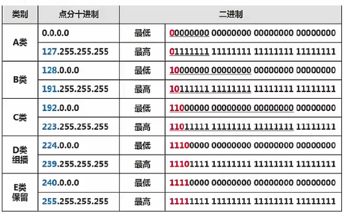

# 传输介质|通信方式|IP地址|子网划分

### 传输介质：

**网线：**双绞线（电信号）

**光纤：**

多模光纤MMF：多信号 LED光源

单模光纤SMF：单信号 激光光源

**无线信道**

### **通信方式和交换方式**

**单工：**子网划分A到B就永远是A到B

**半双工：**A可以到B，B也可以到A 但不能在同一时间

**全双工：**同一时间，A和B可以互相传递

**同步方式:**异步传输,同步传输,串行传输,并行传输

### **ipv4**

点分十进制，实际上机器中是32位的二进制，不足补零，组成部分为网络号和主机号

**分类：**

A类：前缀固定0，前8位是网络号

B类：前缀是10，前16位是网络号

C类：前缀110，前24位是网络号

以上是单拨地址

以下是组拨地址

D类：前缀1110

E 类：前缀 1111

**ip地址表示**：ip地址/网络号

### 子网划分

网络号+子网号+主机号

网络号和子网号都为1，主机号为0，叫做子网掩码

主机号个数：2n次方减2，因为主机号不能全0或者全1

子网号：2n次方

网络号相等，就属于相同网段 

  

