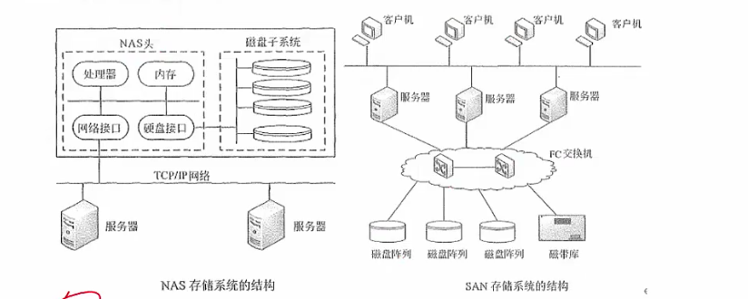

# ipv6|网络规划|网络存储

ipv6 128位 一共有2的128次方个地址

ipv4过度到ipv6，主要采用的三种基本技术

双线议栈：同时支持两套协议

隧道技术：

翻译技术：

### 网络规划与设计

三层模型

核心层：只负责高速数据转发

汇聚层：把网络业务链接到接入层，实施安全，流量，负载和路由的相关策略

接入层：最上层，负责用户信息收集工作和用户管理

PDS 建筑物综合布线系统

 工作区子系统：终端设备到水平子系统的信息插座之间的互联

水平布线子系统：实现信息插座和管理子系统之间的链接

设备间子系统：实现中央主配线架与各种不同设备之间的链接（机房）

垂直干线子系统：多层设备间子系统的互联

管理子系统：链接水平和垂直的干缆线

建筑群系统：各个建筑物通信系统之间的互联，每栋楼之间的互联

**整个联系一个园区从每层到每栋到整个园区的规划设计**

### 网络存储

**磁盘冗余阵列技术RAID** 

数据分散存储在不同磁盘中，可并行读取，可冗余

RAID0 数据分散存储在不同磁盘中，磁盘利用率100%，无备份，不可靠

RAID1 在成对的独立磁盘上产生互为备份的数据，类似主从备份这种概念

RAID2 海明码校验

RAID3 奇偶校验

RAID5  在所有磁盘上交叉的存储数据及奇偶校验信息。所有校验信息存储总量为磁盘容量

**直接附加存储 DAS**

**网络附加存储 NAS** 

**存储区域网SAN**

**这一张简直了，梭哈**

