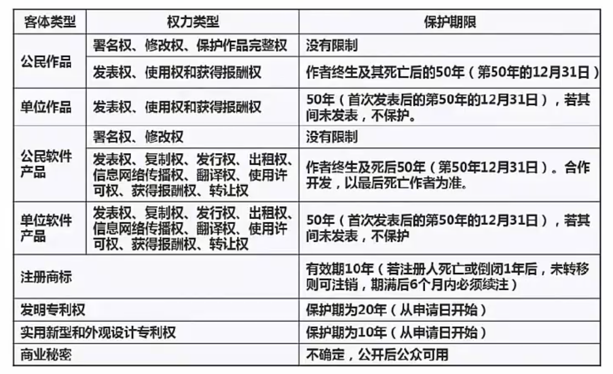
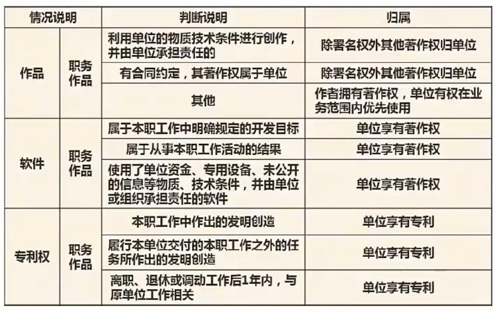
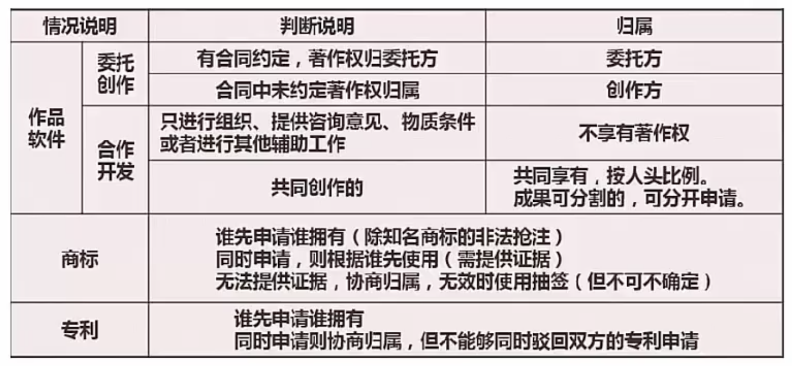
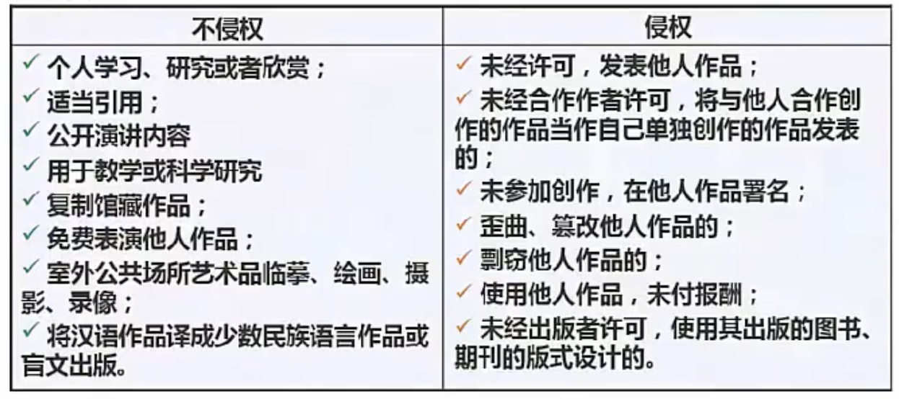

# 知识产权和标准化

 

**知识产权：**

公民，法人，非法人单位对自己的创造性智力成果和其他科技成果依法享有的**民事权**，是智力成果的创始人依法享有的权利和在生产经营活动中标记所有人依法享有的权利的总称，**包含著作权，专利权，商标权，商业秘密权，集成电路布图设计圈和地理标志权等**

**特性**

无体性：无形的抽象的智力成功

专有权：未经授权，不得使用

地域性：只在授予其权利的国家有合法性，有效性

时间性：有受保护期限

**权利类型及保护期限**

大概有普通作品，软件产品，商标，专利，商业机密

**知识产权人确认**

在职期间的创作

委托创作

**侵权行为**

 **一般我们公民开发的软件，创造的著作，即使没有做登记，默认著作权也是作者的**

**标准划分**

国际标准：I 开头 international  es6标准

国家标准：强制GB开头 推荐性 GB/T 推荐性 GB/Z 指导性

行业标准

区域标准

企业标准：