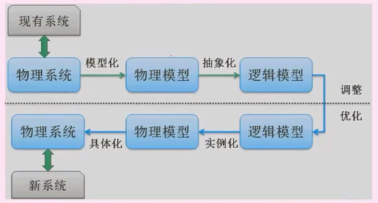

# 信息化战略|规划方法|政务,erp,crm

**信息：**不确定性减少，系统有序程度的度量

**数据环境分类：**

数据文件：类似Excel

应用数据库：类似于mysql oracle 对应的项目数据库

主题数据库：相当于把应用数据库的信息集成，实现信息共享，面向业务

信息检索系统：类似于数据仓库，做数据分析

企业信息系统战略规划三个阶段

信息系统开发方法

结构化法：标准流程，用户至上，界限明确

原型法：需求不明确，包括抛弃原型和进化型原型 （进化）

面向对象法：信息描述及模型与客观实体相对应 （更好的复用性，建立全面合理统一的模型）

面向服务：以粗粒度，松散耦合的系统功能为核心（类似于现在的微服务）抽象三层 操作->服务->业务流程

**系统建模**

系统分析->系统设计->开发

系统分析：分析老系统物理模型，分析抽象出逻辑模型

系统设计：对分析出来的逻辑模型进行优化，调整得出新的逻辑模型

系统开发：编码初心的物理模型，对逻辑模型进行实现

**企业资源计划ERP**

管理思想：ERP是一种管理思想，将企业资源分类管理，是管理思想的变革

软件产品：为企业用户提供一体化解决方案，按需个性化开发

管理系统：是众多子系统的集成管理

**客户关系管理CRM**

共享的客户资料库：市场营销和客户数据相结合

分析能力：分析客户都要要什么

客户服务：客户需要什么

市场营销：客户要什么给什么活动

