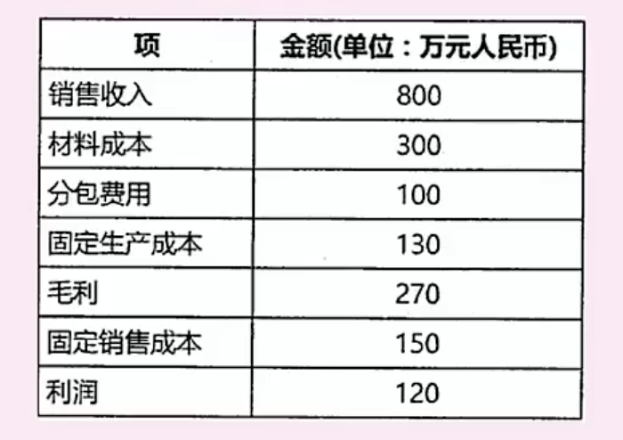

# 系统规划｜可行性分析｜机会选择｜一些指标计算

### **系统规划步骤**

1. 现有系统进行初步调查
2. 分析和确定系统目标
3. 分析子系统组成和基本功能
4. 拟定系统实施方案
5. 进行系统可行性研究
6. 制定系统建设方案

第一步是先对已经有的系统进行分析和调研，站在巨人的肩膀上，

第二步分析需求，确定系统目标，依托企业战略得出信息系统的目标

第三步是细化信息系统目标，拆分出子系统，详细说明子系统应该实现的内容，

第四步是拟定实施方案，确定各子系统之间的优先级，开发顺序

第五步研究是否能够顺利落地，召开可行性论证会

第六步是制定详细的建设方案，落实可行性报告中各项假设条件，产出系统设计任务书

### 项目机会选择

1. 立项的目标和动机
2. 立项价值判断
3. 项目选择和确定
4. 初步调查
5. 可行性分析

### 可行性分析

是否有必要做，是否可以做

1. 复查系统目标和规模
2. 分析现有系统
3. 导出新系统的高层逻辑模型
4. 用户复核
5. 提出并评价解决方案
6. 确定最终推荐的解决方案
7. 草拟开发计划
8. 编制和提交可行性报告

**经济可行性，技术可行性，法律可行性，用户使用可行性（管理可行性｜运行可行心）**

用户使用可行性：是从系统用户的角度来评估系统的可行性

### 成本效益分析

**成本性质分类**

固定成本：一定时间和一定业务范围内，不受业务变动而影响而保持固定不变的成本，例如工资，办公费，固定资产折旧费

变动成本：在一定时间和一定业务范围内其总额随着业务量的变动成正相关，比如原材料

混合成本：有个梯度的，类似电费，水费，税

**技术方式分类**

直接成本：与产品生产直接相关的成本，如原材料，外购半成品，工人工资，机器设备折旧

间接成本：与产品生产没有直接关系的成本，车间房屋折旧，房屋租金，生不生产都要支出，但是他们是生产的前提

沉默成本：指以往发生的，但与当前决策无关的费用，类似于我们做个项目已经花了10万，我们发现接下来还要投入10万才能盈利15万。之前的10万就是沉默成本，是不影响当前角色的

**收益分类**

有形收益：营业额，利润增长

无形收益：品牌价值，行业地位

**盈亏平衡点**

利润：销售额-成本（固定成本+可变成本）

利润等于0，就是盈亏平衡点

盈亏平衡点销售额：总固定成本+可变成本占销售额的比例*盈亏平衡点销售额

盈亏平衡点销售额计算

0 = （130+150）+ 800/（300+100）*x

x = 560 

**净现值**（没有考虑投入规模）

静态收益：不考虑时间因素，看项目周期内投入和产出的绝对数字

动态收益：考虑时间因素，折现率影响

现值：假设折现率是i  n n年后的价值是 原价值 / (1+i) n次方

净现值：考虑时间价值的净利润  每一年的利润求和，其中第n年的利润等于 (第n年的总收入-第n年的总支出) /  （1+当年的折现率）t次方

净现值率

净现值/原始投入总值 ，选投入小产出高

### 投资回收期

静态投资回收期： 关注直接投入产出

动态投资回收期： 关注净现值

**关键就是找到那一年收回成本**

投资回收率：1/投资回收期*100%

