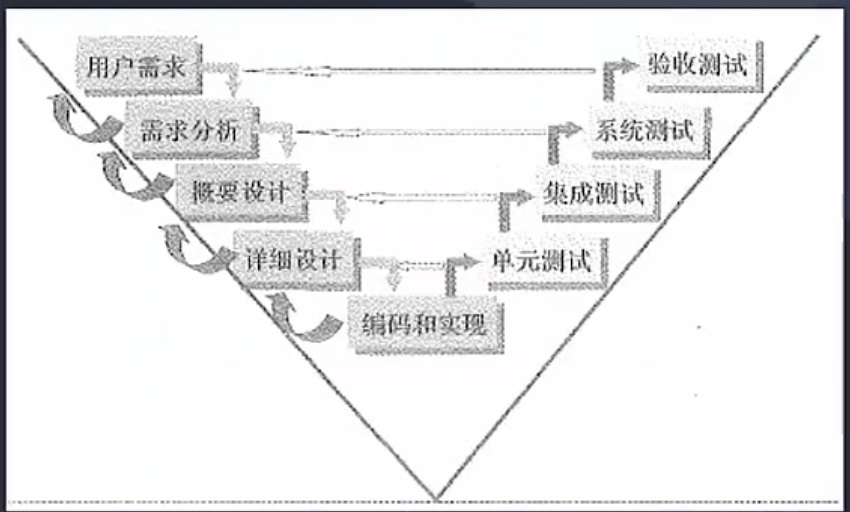

# 软件工程

基本原理：用分阶段的生命周期计划严格管理，实现产品的建设与迭代

软件工程基本要素：方法，工具，过程

### 信息系统生命周期

系统规划阶段：现有系统调查，根据组织发展战略确定信息系统发展战略（可行性研究报告，系统设计任务书）

系统分析阶段：需求分析，产出逻辑模型，具体要做什么（系统说明书，需求说明书）

系统设计阶段：明确做出来是什么样子，把抽象的逻辑变为可视化具体化的产物，把逻辑模型转化为具体的物理模型（系统设计说明书）

系统实施阶段：把可视化具体化的产物进行编码实现，测试，上线（实施进展报告，系统测试分析报告）  

系统运行和维护阶段：系统已经投入正式运行，进行维护和评价，根据一定规则

### 能力成熟度模型

瀑布模型：类似于结构化开发，一般是需求明确，严格按照工程思想构建，一般分为，系统可行性分析，需求分析，设计，编码，测试，运行维护

原型化模型：需求不明确，尝试把各种逻辑模型用原型图的方式转化成有型的物理模型。构造方便，快速，造价低

螺旋模型：规划，风险分析，实施工程，客户评估，注重风险分析，适合超大型的系统

V型：重测试，用户需求明确和需求变更不频繁

增量模型：分期交互，每一次的增量版本都可以作为独立可操作的作品，不利于模块开发，缺乏整体性

喷泉模型：根据需求，面向对象开发

基于构件开发模型c b s d：预先包装的构件来构建应用系统，强调复用性

