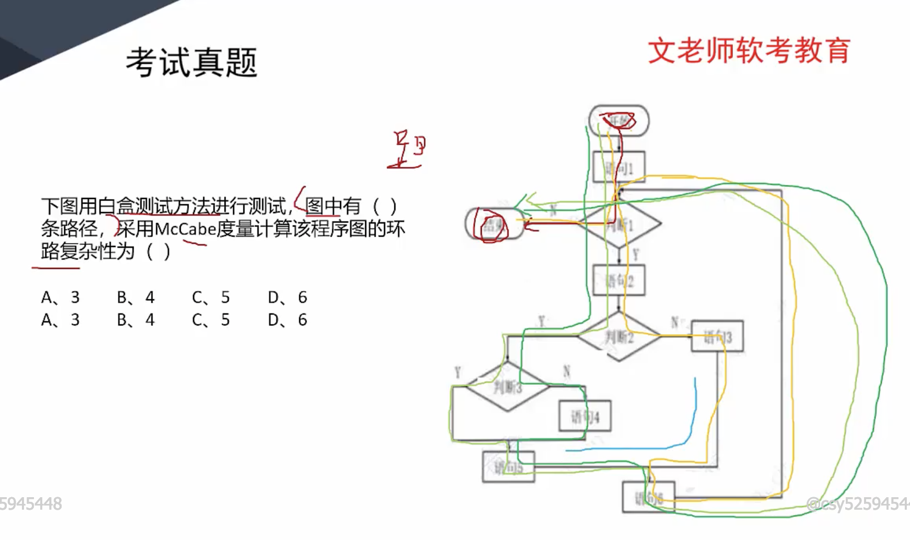
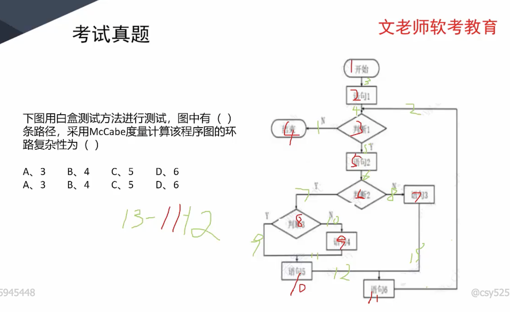
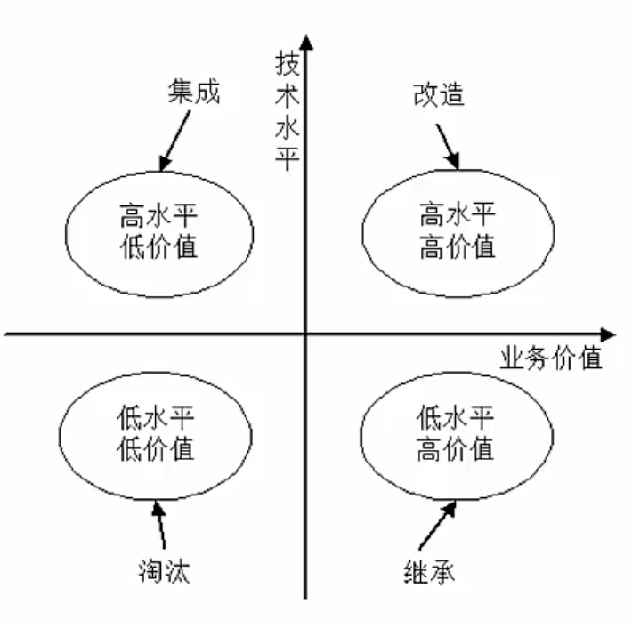

# 系统测试｜系统运行维护

### 软件测试方法

静态测试：不运行程序的测试（桌前检查，代码审查，代码走查）

#### 动态测试

黑盒测试：不关注代码层，只关注业务功能

白盒测试：关注代码逻辑，覆盖代码逻辑的测试用例

### 测试阶段

单元测试：模块化测试

集成测试：多个模块联系在一起测试

系统测试：整体性的测试，偏向功能，健壮性，稳定性

确认测试：验证软件功能，性能和其他特性是否与用户需求一致

（内部确认，alpha测试：开发环境，beta测试：正式环境，验收测试）偏向验收

题外话：回归测试意思是修改后功能是否正常，是否影响其他功能

### 测试策略

自底向上：从底层模块开始，逐步模块合并达到整体性测试

自顶向下：先做系统化的测试，再去关注底层模块

三明治：以上二者相结合

### 黑盒测试用例分类

等价类划分：按照数据特性分类，同一类的测一种，重复步骤，覆盖所有的有效等价类

边界值划分：每一类的边界值作为测试用例

错误推测：凭经验推测

因果图：由结果反推原因

### 白盒测试用例分类

语句覆盖SC：所有代码语句都走一遍（覆盖层级低，因为条件语句有两面性，所以走不完所有的条件判断）

判定覆盖DC：条件的真假分支都要覆盖

条件覆盖CC : 判定是指（）里面最终是true  , 条件覆盖是（）内每一个关系判定都要覆盖

条件判定组合覆盖CDC：同时满足判定覆盖和条件覆盖

路径覆盖：语句运行路线的各种可能

### 软件度量

软件外部属性：面向管理者和用户的属性，类似于性能指标

软件内部属性：面向软件本身，如可靠性

## McCabe 度量法

假设有向图有向边数为m

节点数是n

环路复杂度等于 m-n+2

### 运行和维护

**衡量遗留系统价值是两个维度，技术水平，业务价值**

淘汰：直接不要

集成：代码不换，集成业务

继承：继承业务，更换代码

改造：修改一下

### 系统转换

直接转换：直接老系统被新系统取代

并行转换：新老系统并行工作一段时间

分段转移：分期分批逐步转换

### 系统维护

时间和成本是最多的

#### 可维护性

维护人员理解，改正，改动和改进的难易程度

#### 可维护性指标

易分析性

易改变性

稳定性 ：实际上是低耦合的考究

易测试性

维护行的依从性

### 系统维护类型

硬件

#### 软件

正确性维护，适应性维护，完善性维护，预防性维护（都是字面意思）

数据

