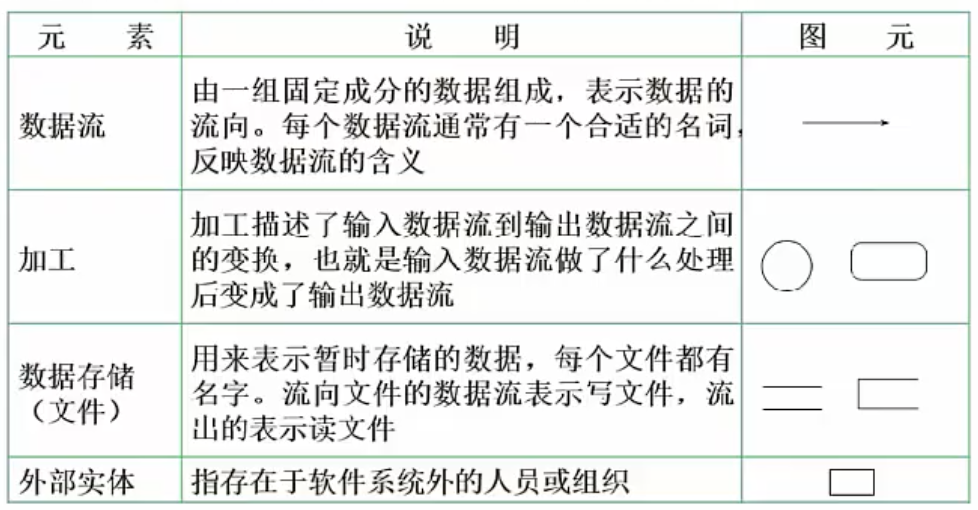

# 软件需求｜需求获取｜结构化需求分析

  

### 需求开发

需求获取

需求分析

需求定义

需求验证

### 需求管理

变更控制 ： 需求变化

版本控制 ：

需求追踪

需求状态跟踪

### 需求分类

业务需求：反应企业或客户对系统高层次目标要求，是大方向，非细节的需求

用户需求：业务是用户（使用者）需要使用的相对细节的需求

系统需求：从技术角度描述的功能需求，软件功能

​	功能需求：需要实现的软件功能

​	非功能需求：性能需求，安全需求等非业务需求，表现为系统的品质

​	设计约束：对系统一些约束说明，类似必须unix系统，精度

### 需求获取方法

用户访谈：一对一，有代表性的用户，最多一对三，包括结构化（列好问题），非结构化

问卷调查：用户多，无法一一访谈

采样：

情节串联板

联合需求计划：开会，联合关系代表讨论需求

需求记录技术：

###  需求分析

需求应该有无二义性，完整性，一致性，可测试性

**需求分析任务**

1. 绘制系统上下文范围关系图
2. 创建用户界面圆形
3. 分析需求的可行性
4. 确定需求的优先级
5. 未需求建立模型
6. 创建数据字典
7. 使用QFD(质量功能部署)

结构化需求分析：自顶向下，逐步分解，面向数据

结构化需求分析三大模型：功能模型（数据流图），行为模型（状态转换图：我理解为流程图），数据模型（E_R图）

**数据流图构成部件**

