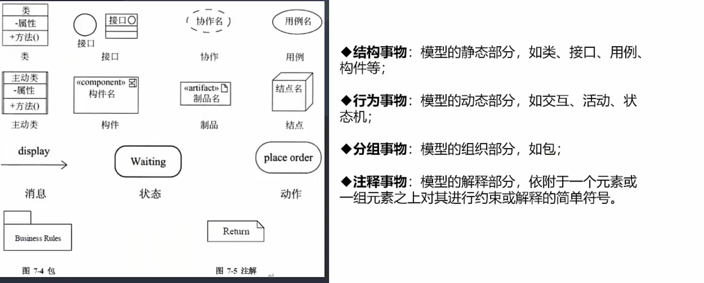
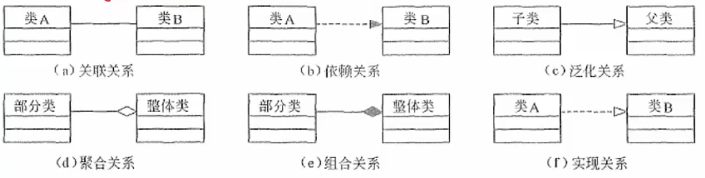

# 面向对象基本概念｜需求分析

**对象就是类的实际存在，类是对象的统一属性和功能的规范描述**

重载：方法名相同，参数不一样 （并不一定在继承关系内，类内部也是可以的）

重写/覆盖：把原来的函数替换掉

### 面向对象的需求分析

#### 五个活动

认定对象：划分出有哪些参与对象

组织对象：对象有哪些属性

描述对象间的相互作用：对象间关系

确定对象的操作：对象行为和作用

定义对象的内部信息：？

#### 两种模型

用例模型

分析模型

### 统一建模语言UML

统一建模语言：可视化建模语言

包括三部分：构造快（事物，关系，图），规则，公共机制

### 事物之间的关系

依赖关系：随着变化而变化，比如明星依赖经纪人

关联关系：对象之间的连接，比如医生，病人，两个事物有关联

泛化关系：一般和特殊的关系，学生和研究生

聚合关系：部分和整体没有共同生命周期，类似于班级和同学

组合关系：共同生命周期，整体不存在，部分就不存在，人和大脑

实现关系：实现类与接口

## 6中关系的符号

