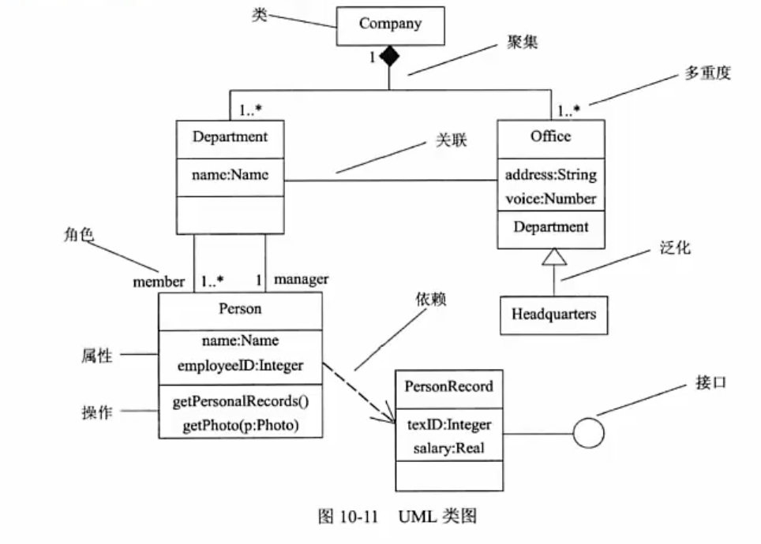
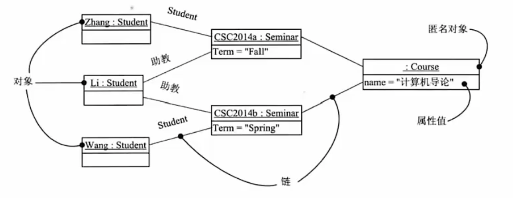
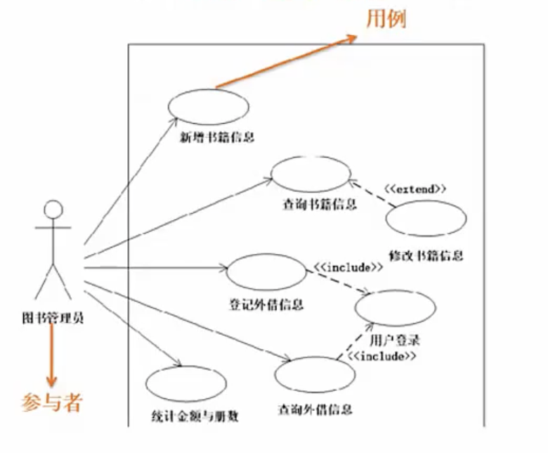
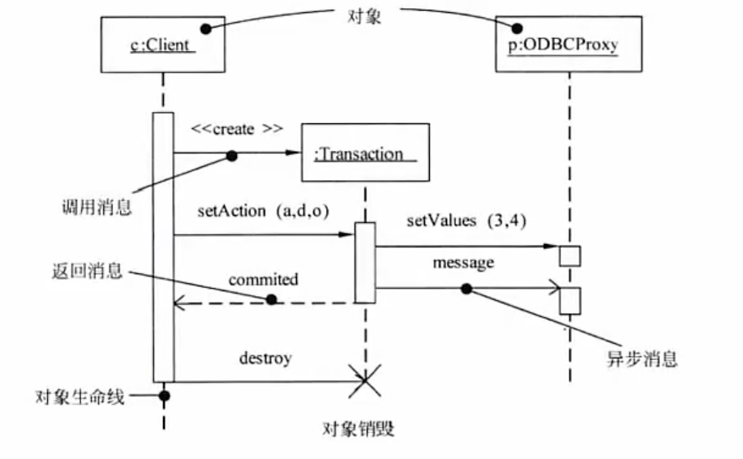
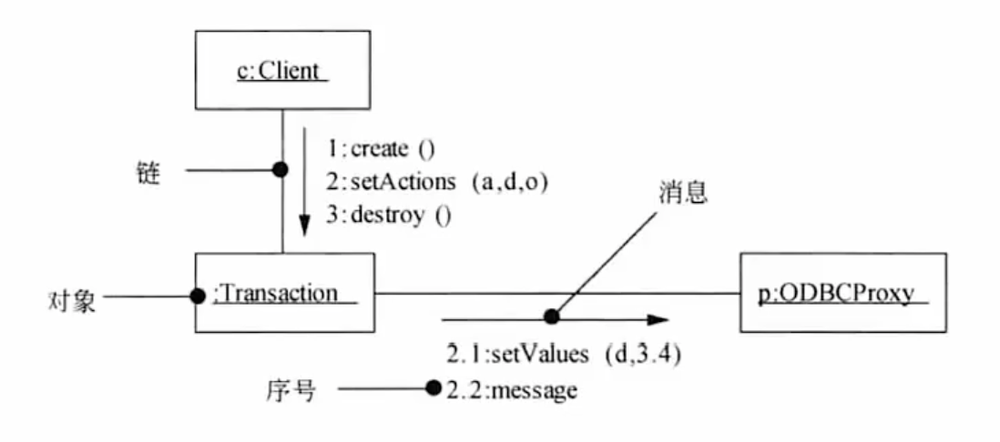
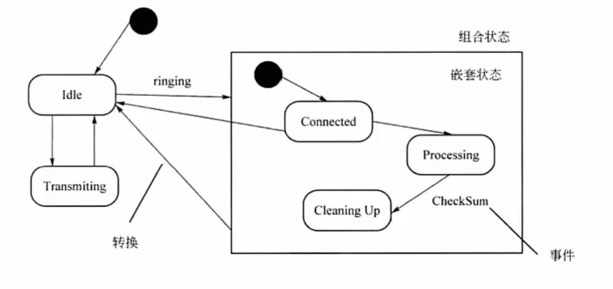
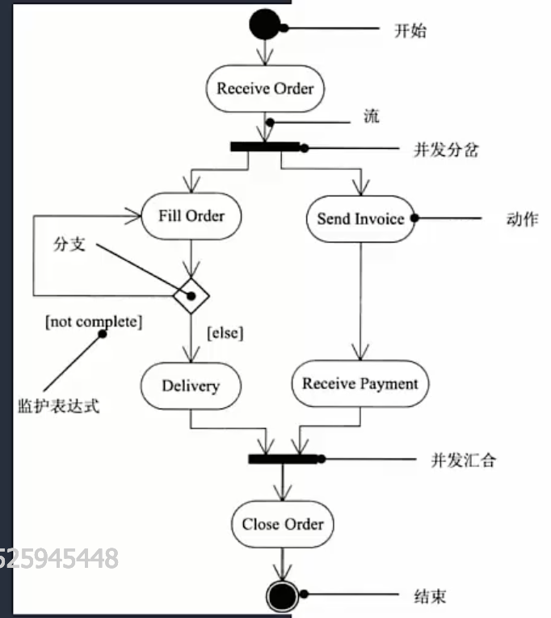
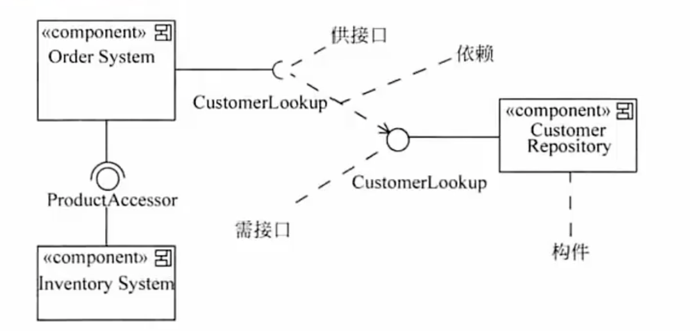
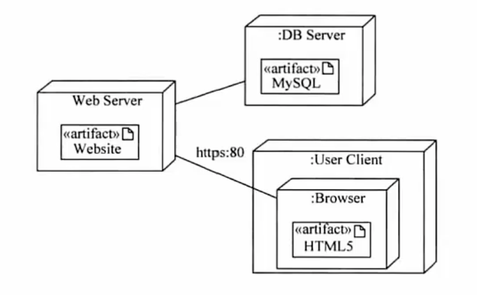
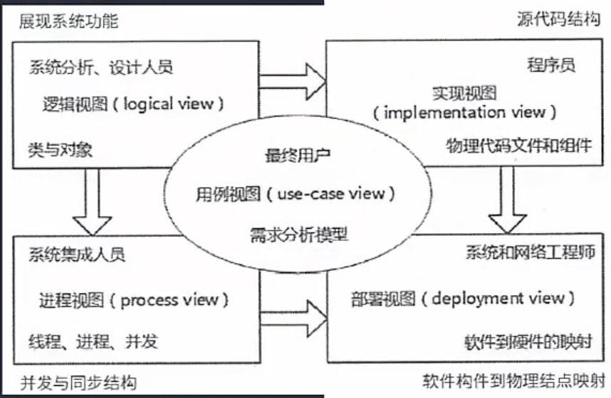

# UML图｜视图

### 

**类图：对象，接口，协作和之间的关联关系**

**对象图：是类的快照**

**用例图：用例和参与者之间的关系（独有三个关系，扩展，包含，泛化），用例就是功能**

****

**序列图：场景的图形化表示，描述时间顺序组织的对象之间的交互活动，消息的传递过程**（非常类似于接口调用的一些说明描述）

**实线实心箭头：同步消息**

**实现空心箭头：异步消息**

**虚线空心箭头：返回消息**

**通信图：协作图 ，也是消息传递，只不过是用序号标识传递哪些消息**

**状态图：单个对象在多个用例中的行为中的状态切换**

实心圆：起点和终点

圆角框框：状态

线上的动作：是触发的事件

**监护条件就是一些前提条件**

**活动图：特殊的状态图，体现一个活动到另外一个活动的流程**

**构建图：构建是指可复用的模块，展示构建之间的组织和依赖**（静态图）

半圆：对外提供的接口 供接口

圆：需要的接口 需接口

**部署图：部署需要什么，怎么部署（静态图）**

### UML 视图

视图是图的抽象，逻辑模型

