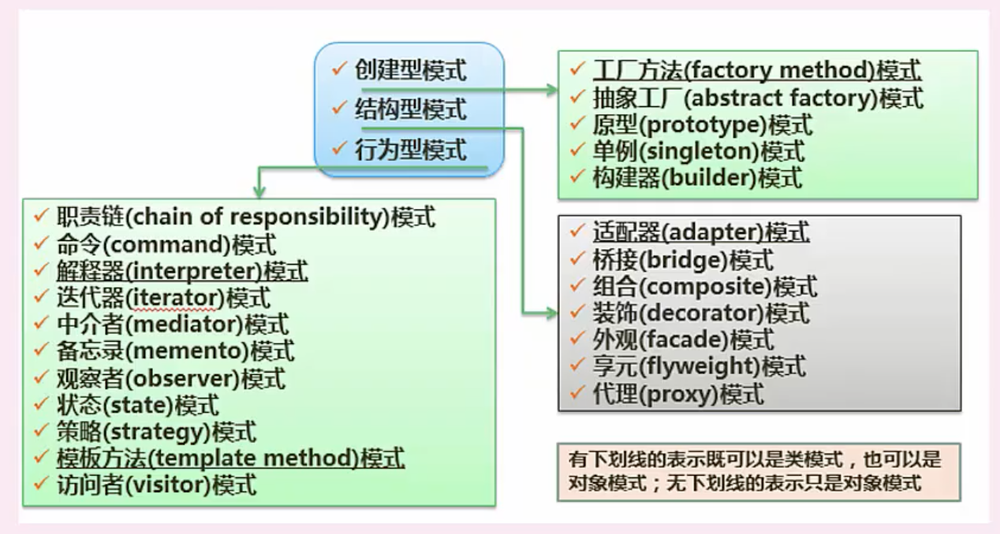
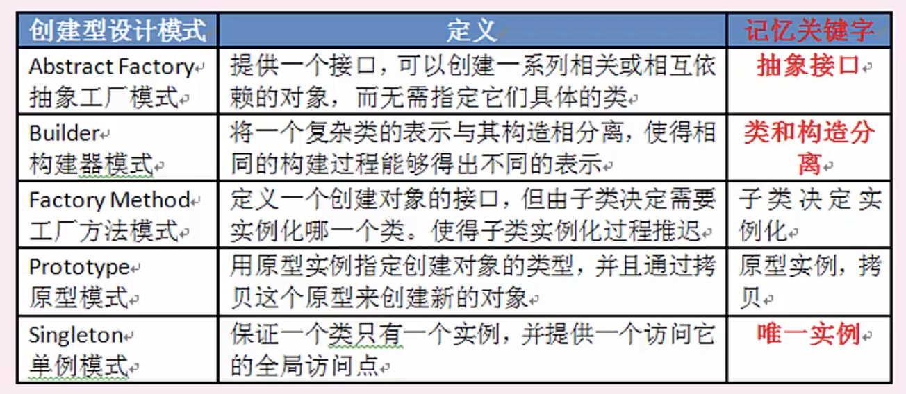
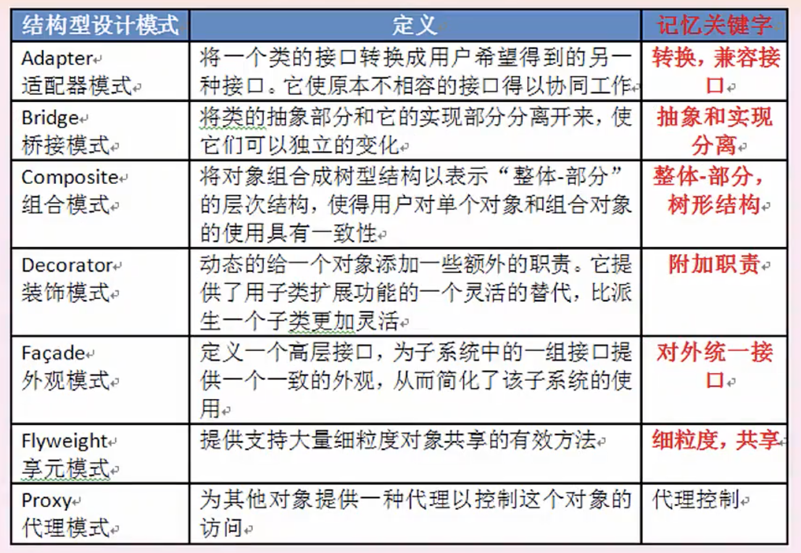
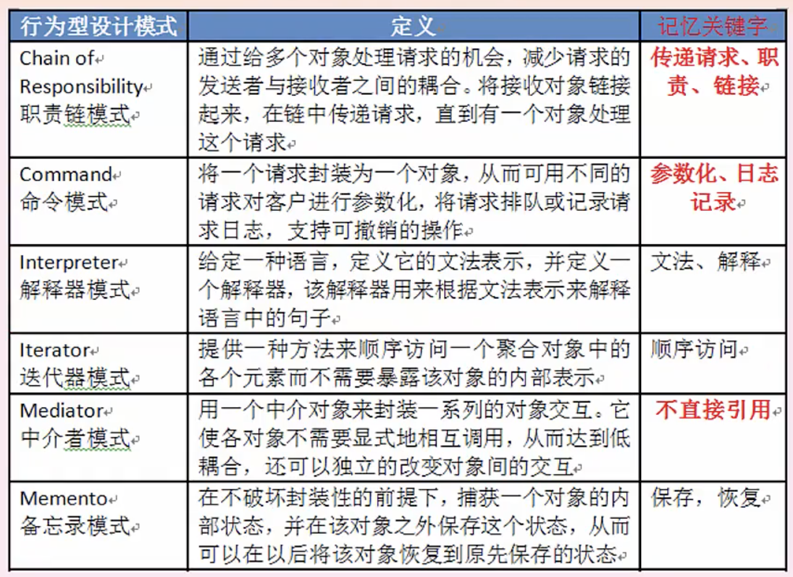
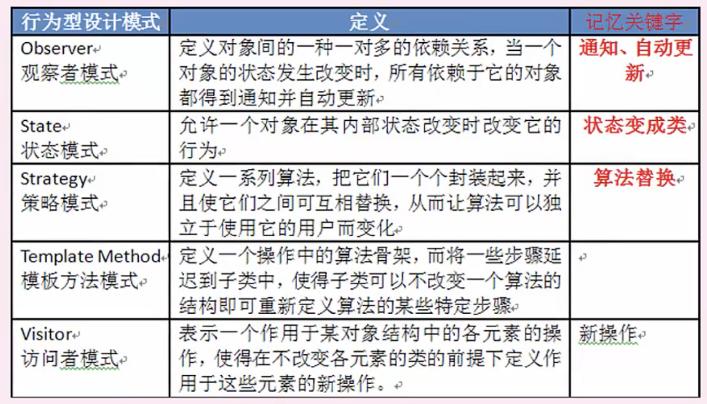

# 系统设计｜设计模式

### 处理流程设计

**业务流程建模**：根据已有的业务系统结合当前企业的情况，制定适合企业的模型

标杆瞄准：调研行业标杆构建适合本公司的模型

**IDEF**：（一系列建模，分析和仿真方法的统称），至于IDEF0-IDEF14 都代表啥，饶了我吧～

DEMO：

Petri网

业务流程建模语言

基于服务的BPM：基于web服务的思想对业务流程进行建模

IDEF0 ： 业务流程（功能）建模

IDEF1X：数据建模（E-R）

IDEF4：面向对象建模

IDEF8：用户界面建模

IDEF12：组织结构建模

BPR：**业务流程重组**，不管老系统，目的是改善成本，质量，服务和速度方面的大幅提升

BPM：**业务流程管理**，以业务流程为中心，目的是提高业务绩效

### 结构化设计主要内容

概要设计，详细设计

### 系统设计（结构化设计）原理

抽象化

自顶而下，逐步求精

信息隐蔽，意思是底层和上层要分开，独立

模块独立（高内聚，低耦合）

### **系统设计（结构化设计）原则**

模块大小保持适中

调用深度不宜过深

尽量能够高度封装对外提供多的API，多扇入

尽量少的调用各种模块，少扇出，（调用越多，耦合越严重）

单入口，单出口

模块的作用域应该在模块内

功能应该是可预测的

### 面向对象设计

分析模型，设计

### 面向对象设计原则

单一职责原则

开放-封闭原则：对扩展开放，对修改封闭，类似于迭代过程，某个方法写好了，类似 convert(),升级后变convert_ext() 而不是重写这个方法

李氏替换原则：子类可替换父类，类似于Spring ioc 生命的可能都是某个接口，但是实际接收的时候都是各个实现类，暂且这么理解吧

依赖倒置原则：业务代码里面只关注接口，实现层可能有多种方案，类似于缓存驱动可能有文件方案，redis 方案等等

接口隔离原则：就是接口要有单一职责，不能一个接口能干这又能干那，如果有多个功能，就拆成多个专门的接口

组合重用原则：类似于PHP trait

迪米特原则：也跟单一职责，和原子性一个意思

### 设计模式

架构模式->设计模式->惯用法

**类模式和对象模式都适用的设计模式**

工厂方法，适配器，解释器，模板方法

### 人机界面三大原则

**用户自由控制**

减少用户记忆负担

**保持界面一致性**

