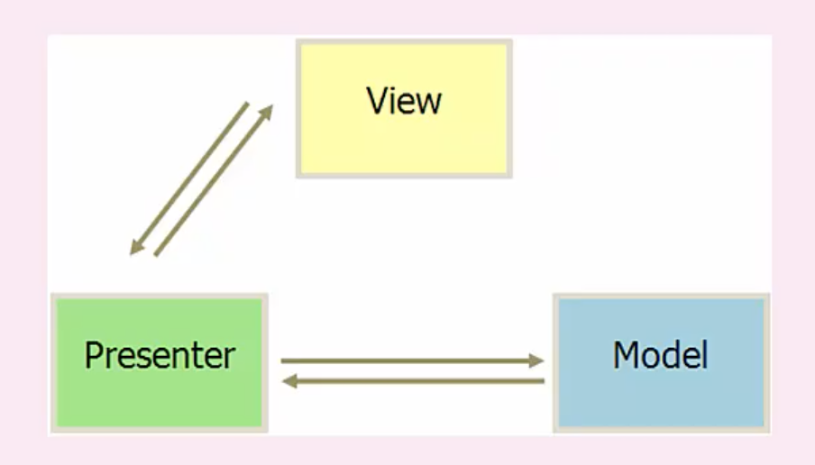
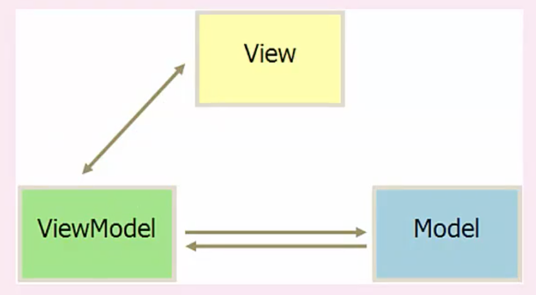

# Web 应用技术

### 应用层负载均衡

http重定向

反向代理服务器

### 传输层负载均衡技术

dns 域名解析负载均衡

Nat 负载均衡，一般在网关位置，可以通过硬件实现

MVP

mvvm

### 微服务

拆分服务，服务职责单一，总体业务不变

好处就是：业务系统拆成相对原子性的各个小系统，低耦合，业务清晰，并且各个系统相互独立，而且系统间不拘泥技术选型等问题，只要遵循服务标准就行

缺点就是：部署变得复杂，数据一致性难易保证，延迟问题

