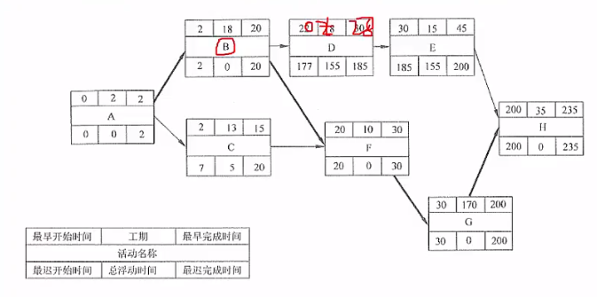

# 项目管理｜进度管理

（考得偏少，知识点不够与时俱进）

WBS ： 项目需求拆包

**项目范围包含产品范围**

产品范围的最小单位是工作包，WBS

### 进度管理

**进度管理的最小单位是活动**

**软件规模计算**

**cocomo模型**，越高级别考虑越多，最低级别只考虑代码行

### 进度安排

gantt 甘特图 ： 什么时间安排什么任务，任务的前后顺序，任务的并行关系

pert 项目计划评审：不反应并行关系，反应活动之间依赖关系

### 关键路径法：最短工期，但其实是从开始到结束时间最长的路径

### 七格图

顺推：最早完成时间取最大值

逆推：最晚完成时间取最小值

