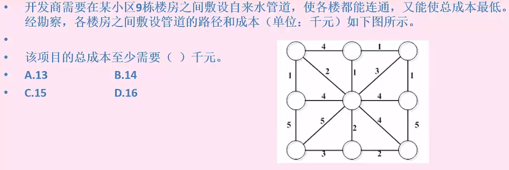
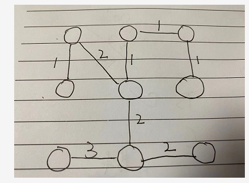
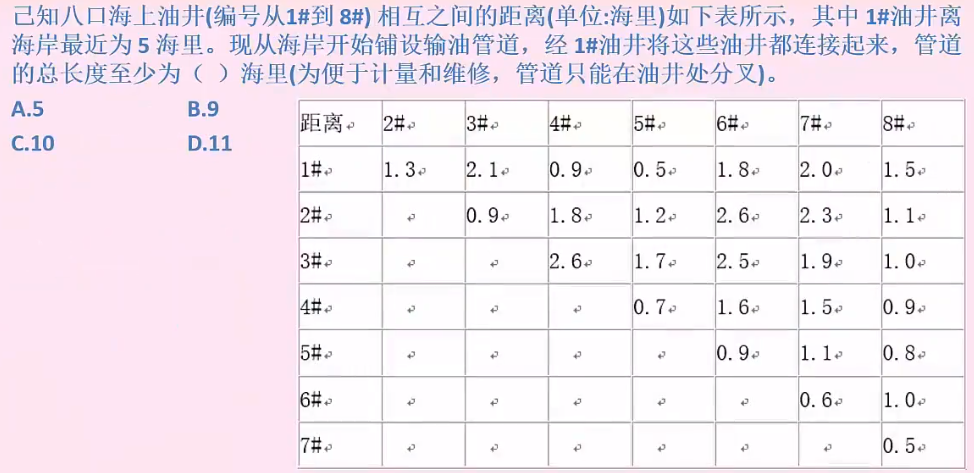
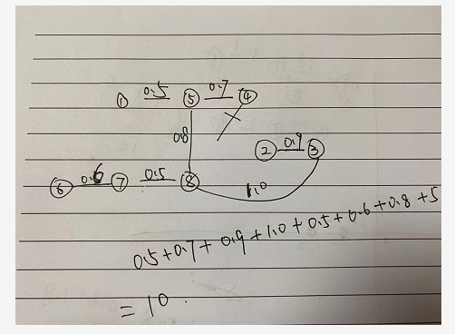
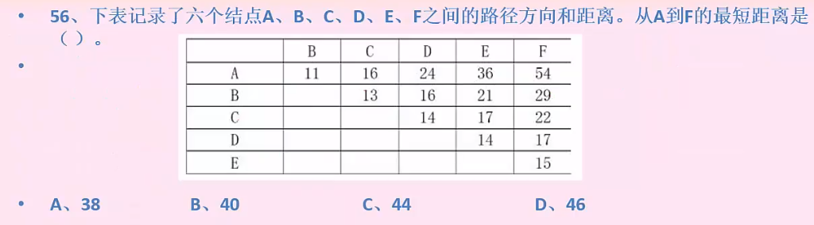
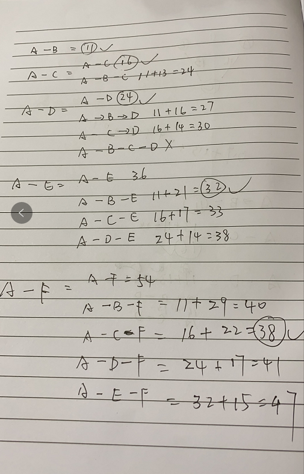
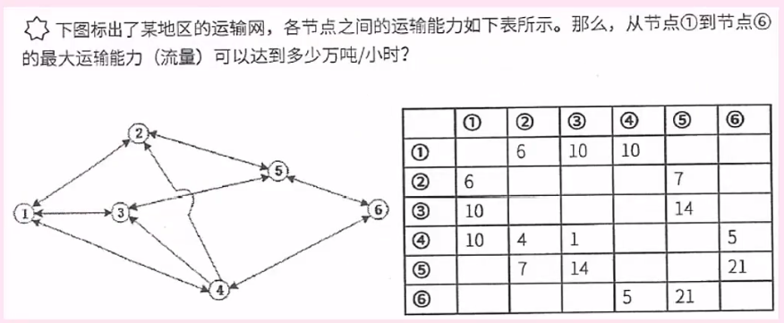
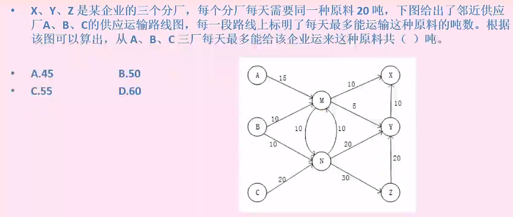
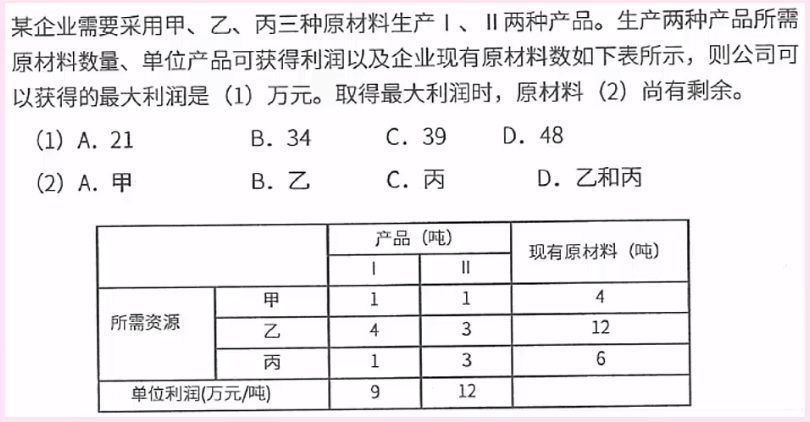
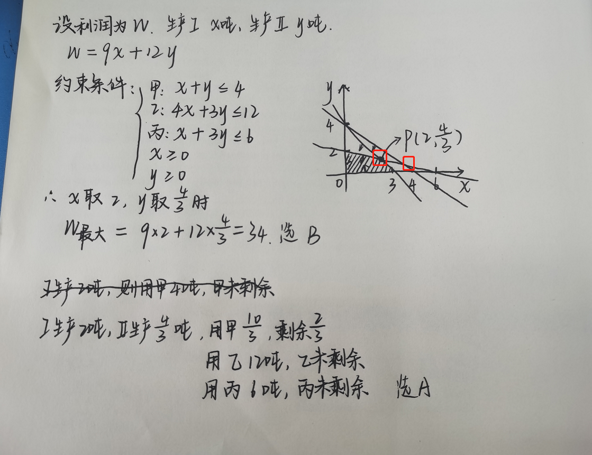

# 数学与经济管理（一）

### 最小生成树

解题图

思路

把n个点连接起来至少需要n-1条边

尽量选最少成本的线路

不允许成环

思路

注意两点之间的最小值把关系连好

从最小值连线，依次类推

### 最短路径

题外话：关键路径是最长路径，非最短路径

 

这题目有点傻逼

### 网络与最大流量

计算过程太庞大了，就不算了

思路 

短板原理

优先把最大的运输路线走完，实施计算每一段还剩多少运输能力，直到无法运输到为止

答案 23

和上一题思路差不多，刚好55吨全部能够运完

### 线性规划

在一组约束条件下寻找目标函数的极值，极大或者极小值

假设利润为f,需要A产品x，b产品y

则需要满足

1. x > 0
2. y > 0
3. x + y <= 4
4. 4x + 3y <= 12
5. x + 3y <= 6

利润是 9x + 12y 

思路一： 不用画图 直接粗暴 两两求交点 再带入计算

3 & 4 得出 x=0  y=4

3 & 5 得出 x=3 y=1

4 & 5 得出 x=2 y=4/3

带入计算符合的是 x=2 y=4/3 得34 选B  甲剩余2/3

思路二画图，确定交点再计算

