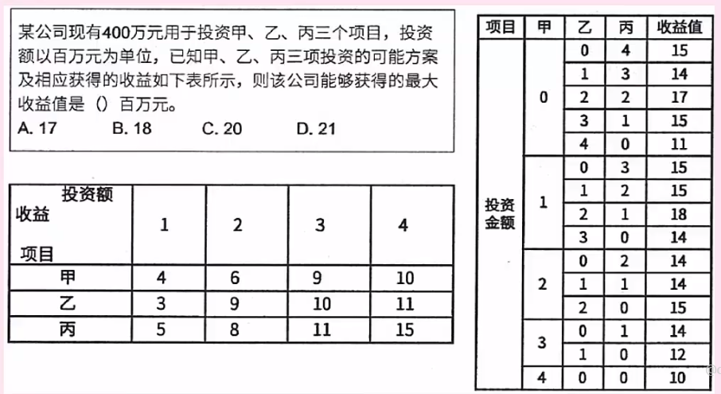
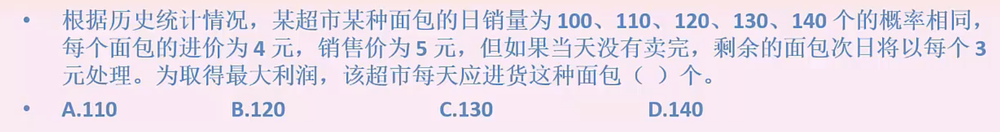
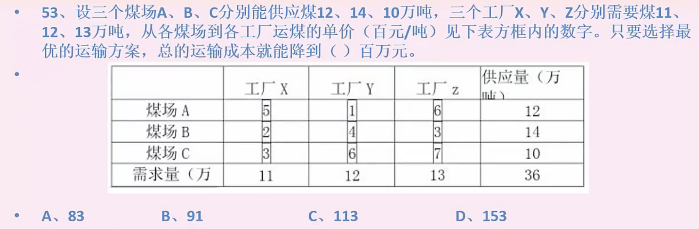
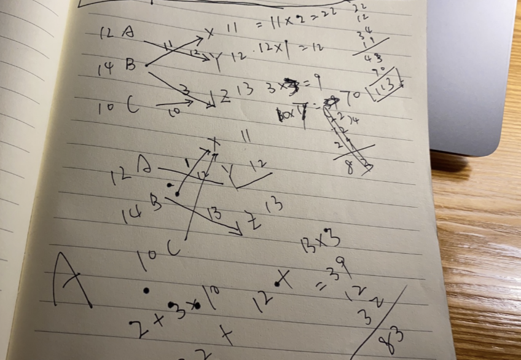
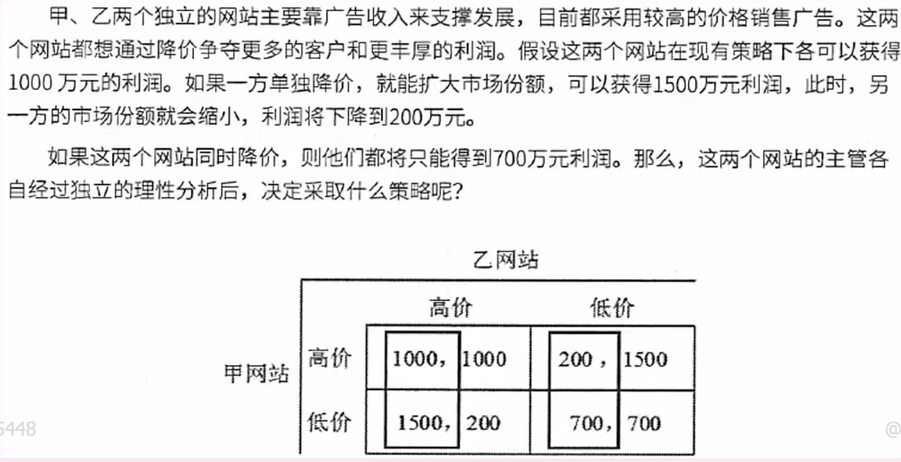
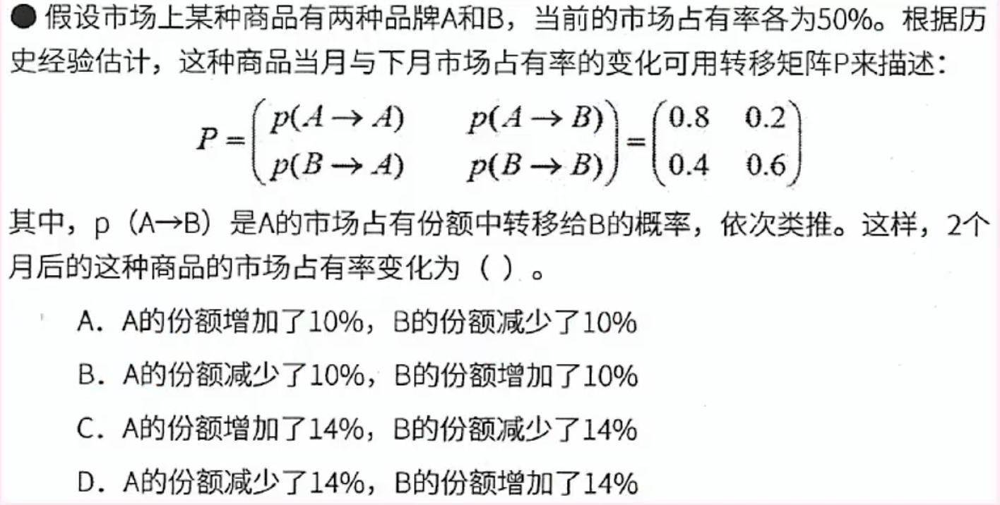
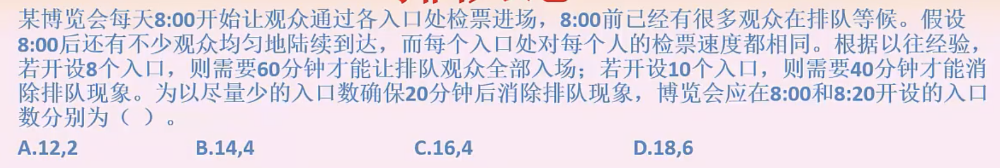
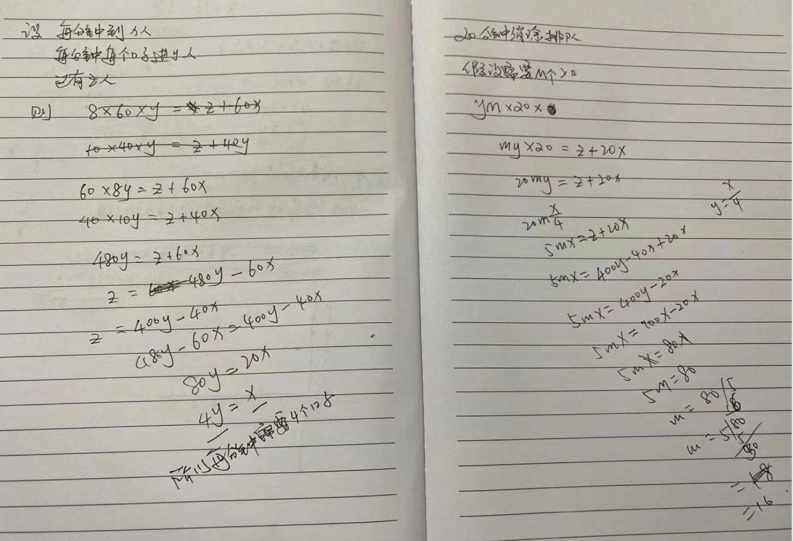
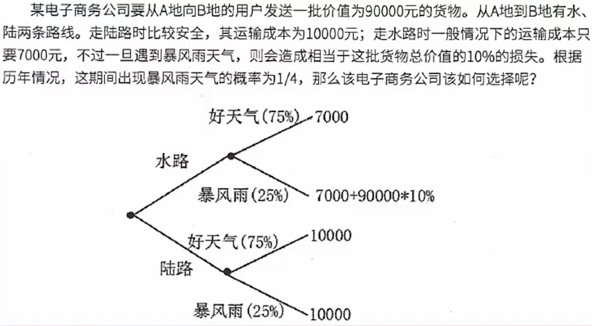

# 数学与经济管理（二）

### 动态规划

 穷举法

解题思路

首先分析变量，销量和进货量，利润和概率是常量

分别列出来100-140对应销量的利润值求平均值

选B

### 伏格尔法

解题 无技巧解法

1.  第二种思路，伏格尔法
2. 每行每列次小减最小的到差
3. 找出所有差的最大值
4. 最大值的那一列或者行锁定最小的陈本
5. 以此类推

### 博弈论

 双输场面

### 状态转移矩阵

 

解题思路，主要是看懂矩阵转移的规律

A-A 是80%

B-A 是40%

B 直接1-A

直接算两个月

选C

### 排队论

思路

找变量

每分钟到x人

每分钟每个扣子进y人

已经有z人

则选 C

### 决策论

不确定型决策5种方案

悲观主义准则：小中取大

乐观主义准则：大中取大

折中主义：折中系数

等可能性准则：1/n

后悔值准则:选后悔值最小的

### 决策树

比较简单，直接算出来两种方案需要的运费+风险成本比较即可

