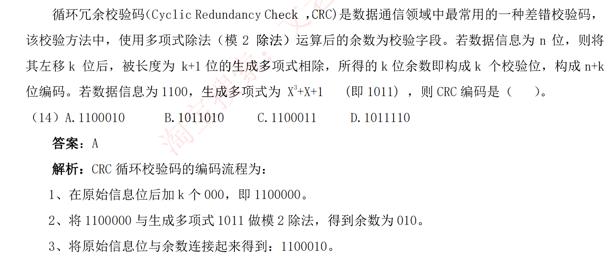

# 典型计算题汇总

### **求CRC编码典型问题**

第一步：多项式转换成二进制码，这里给出来了1011

第二步：数据信息末尾补充 **二进制码位数-1**个0 1100000

第三部：模二运算，也就是每次都做亦或，同0非1，得到的余数补充到数据信息后面则是CRC编码

### 指令流水线

**指令流水线：**将指令分成不同段，每段由不同的部分处理

**流水线周期：**指令分成不同执行段，其中执行时间最长的一段为流水线时间

**流水线执行时间：**1条指令总执行时间+（总指令条数-1）*流水线周期

**流水线加速比：**不使用流水线总执行时间/使用流水线总执行时间

**流水线吞吐率：**总指令条数/流水线执行时间

**超标量流水线技术：**常规流水线度为1，度的扩大就是成倍的增加了流水线的执行，这里主要影响 指令条数 = 指令条数（这里应该是指拆分后的）/度

#### 注意：总指令条数不是指令拆成的段数，而是指向流水线输入的指令数，或者说执行多少次

